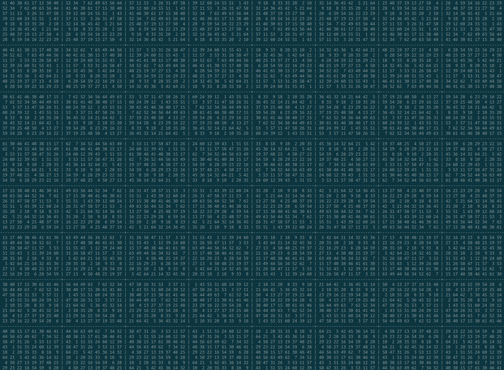

# Sudoku Algorithm & Demo 



## Directory

```shell
.
├── bin
│   └── demo
├── data
│   ├── input.txt
│   └── output.txt
├── run
├── img
│   └── 64x64_sudoku_img.png
├── Makefile
├── obj
│   ├── demo.o
│   └── sudoku.o
├── README.md
└── src
    ├── demo.c
    ├── sudoku.c
    └── sudoku.h
```

## Usage of Demo

### Generate Sudoku

Generate N x N randomly ordered sudoku by using `./demo <N>`, and make sure that the 'N' is **power of two**. (The result is also written in './data/output.txt'.)

**e.g.**

```shell
$ ./run 4
Generate 4 x 4 sudoku to 'data/output.txt'

 2 4 | 1 3
 1 3 | 2 4
-----+-----
 4 2 | 3 1
 3 1 | 4 2
```

```shell
$ ./run 9
Generate 9 x 9 sudoku to 'data/output.txt'

 5 4 9 | 8 2 7 | 1 6 3
 1 6 3 | 5 4 9 | 8 2 7
 8 2 7 | 1 6 3 | 5 4 9
-------+-------+-------
 4 5 1 | 7 8 2 | 9 3 6
 9 3 6 | 4 5 1 | 7 8 2
 7 8 2 | 9 3 6 | 4 5 1
-------+-------+-------
 6 9 5 | 2 7 8 | 3 1 4
 3 1 4 | 6 9 5 | 2 7 8
 2 7 8 | 3 1 4 | 6 9 5
```

```shell
$ ./run 25
Generate 25 x 25 sudoku to 'data/output.txt'

 10 15  2 12 |  6 11 14  3 | 13  9 16  4 |  5  8  7  1
  6 11 14  3 | 10 15  2 12 |  5  8  7  1 | 13  9 16  4
 13  9 16  4 |  5  8  7  1 | 10 15  2 12 |  6 11 14  3
  5  8  7  1 | 13  9 16  4 |  6 11 14  3 | 10 15  2 12
-------------+-------------+-------------+-------------
 15 10 12  2 | 11  6  3 14 |  9 13  4 16 |  8  5  1  7
 11  6  3 14 | 15 10 12  2 |  8  5  1  7 |  9 13  4 16
  9 13  4 16 |  8  5  1  7 | 15 10 12  2 | 11  6  3 14
  8  5  1  7 |  9 13  4 16 | 11  6  3 14 | 15 10 12  2
-------------+-------------+-------------+-------------
  2 12 10 15 | 14  3  6 11 | 16  4 13  9 |  7  1  5  8
 14  3  6 11 |  2 12 10 15 |  7  1  5  8 | 16  4 13  9
 16  4 13  9 |  7  1  5  8 |  2 12 10 15 | 14  3  6 11
  7  1  5  8 | 16  4 13  9 | 14  3  6 11 |  2 12 10 15
-------------+-------------+-------------+-------------
 12  2 15 10 |  3 14 11  6 |  4 16  9 13 |  1  7  8  5
  3 14 11  6 | 12  2 15 10 |  1  7  8  5 |  4 16  9 13
  4 16  9 13 |  1  7  8  5 | 12  2 15 10 |  3 14 11  6
  1  7  8  5 |  4 16  9 13 |  3 14 11  6 | 12  2 15 10
```

### Solve Sudoku

Before solve `N` x `N` sudoku, make sure that your input data is in './data/input.txt'.

After executing the command, the result of solving sudoku is in './data/output.txt' if it is existed.

```shell
$ ./run
Read 9 x 9 sudoku from 'data/input.txt'

 5 4   | 8 2   | 1 6  
       |   4   |     7
   2 7 | 1   3 | 5 4 9
-------+-------+-------
 4   1 | 7   2 | 9 3  
   3   |       | 7   2
 7   2 | 9     | 4   1
-------+-------+-------
 6   5 | 2   8 |     
     4 |   9   | 2   
 2 7   | 3   4 |   9 5
Generate 9 x 9 sudoku to 'data/output.txt'

 5 4 9 | 8 2 7 | 1 6 3
 1 6 3 | 5 4 9 | 8 2 7
 8 2 7 | 1 6 3 | 5 4 9
-------+-------+-------
 4 5 1 | 7 8 2 | 9 3 6
 9 3 6 | 4 5 1 | 7 8 2
 7 8 2 | 9 3 6 | 4 5 1
-------+-------+-------
 6 9 5 | 2 7 8 | 3 1 4
 3 1 4 | 6 9 5 | 2 7 8
 2 7 8 | 3 1 4 | 6 9 5
```

---

**<center>Unfinished</center>**

---